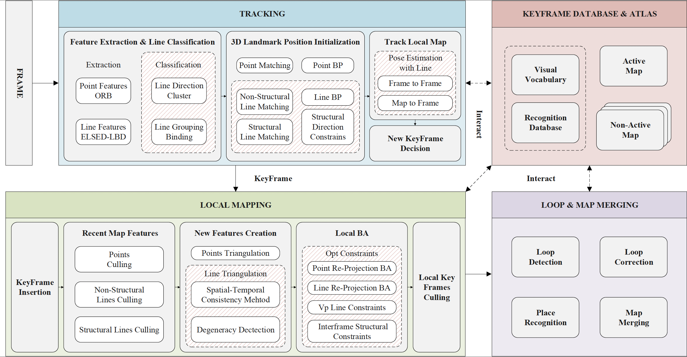
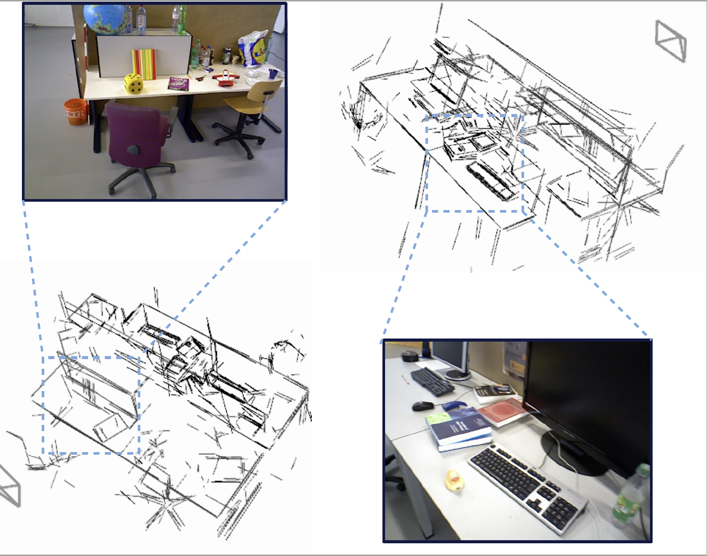
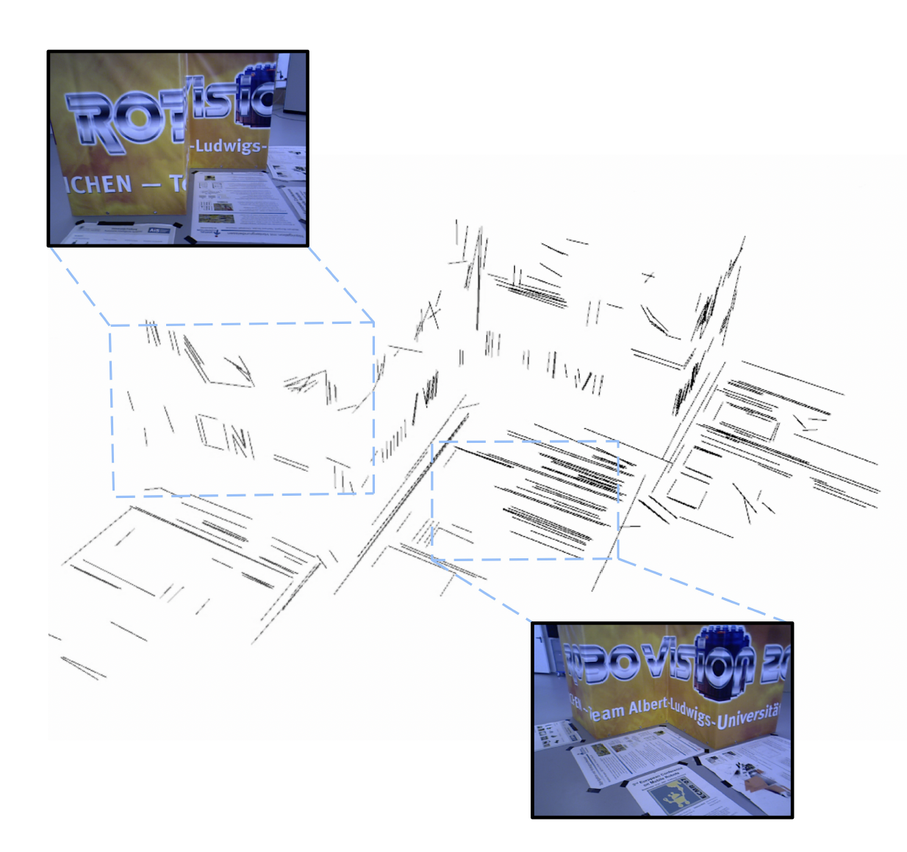
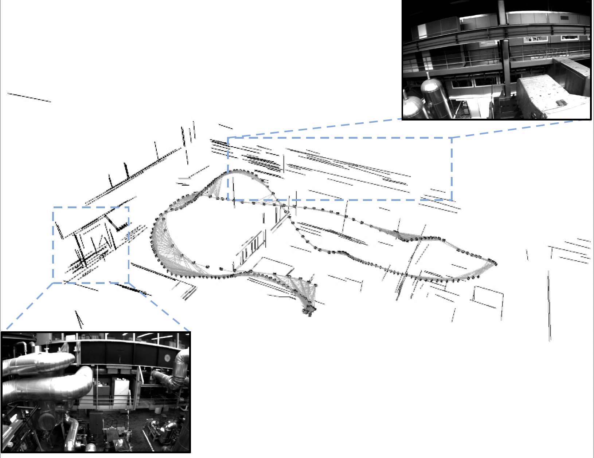
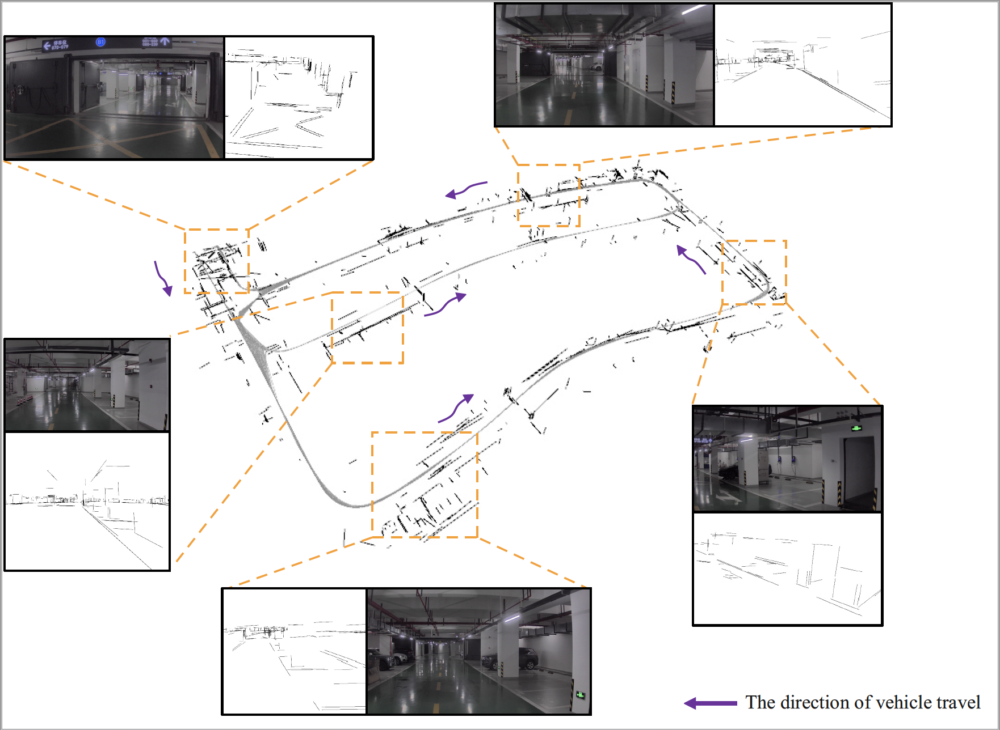

# UL-SLAM （coming soon）

This repository proposes a general line-based SLAM system that combines **points, structural and non-structural lines** and aimed at improved tracking and mapping accuracy by relying on **line classification, degeneracy identification and geometric constrains**. By exploring the directional constraints on the original line features, the degeneracy issues associated with Plücker representation in the line triangulation process can be alleviated. More details can be found in our papers. If you have any **technical questions** regarding to the implementation, please kindly send email to us. 

**Authors:** Haochen Jiang $^* $, Rui Qian $^* $, Liang Du, Jian Pu and Jianfeng Feng

## News
- Start code clean and orginize. Due to the substantial volume of code and the involvement of certain compliance issues, we will progressively release and update it.

##  1. <a name='RelatedPublications:'></a>Related Publications:

[1] Campos, Carlos, et al. "Orb-slam3: An accurate open-source library for visual, visual–inertial, and multimap slam." IEEE Transactions on Robotics 37.6 (2021): 1874-1890. (https://arxiv.org/abs/2007.11898)

[2] Gomez-Ojeda, Ruben, et al. "PL-SLAM: A stereo SLAM system through the combination of points and line segments." IEEE Transactions on Robotics 35.3 (2019): 734-746. (https://arxiv.org/abs/1705.09479)

##  2. <a name='TheSystemWorkflow:'></a>The System Workflow: 
    


##  3. <a name='QualitativeIllustration:'></a>Qualitative Illustration:

* fr3_long_office (dataset TUM RGB-D)

     

* fr3_structure_texture_far (with out loop closure) (dataset TUM RGB-D)

     

* MH_04_difficult (dataset EuRoC MAV)

    

* UG02 (data_odometry_gray, self-collected dataset)

    
    

##  4. <a name='Prerequisites'></a>Prerequisites

We have tested the library in **ubuntu 16.04** and **ubuntu 18.04**, other platforms may encounter compilation-related issues with the library (g2o/Pangolin). Most of the dependency issues can be resolved by referring to the configuration process in the [ORB-SLAM3](https://github.com/UZ-SLAMLab/ORB_SLAM3). A powerful computer (e.g. i7) will ensure real-time performance and provide more stable and accurate results.

###  4.1. <a name='C11orC0xCompiler'></a>C++11 or C++0x Compiler
We use the new thread and chrono functionalities of C++11.

###  4.2. <a name='Pangolin'></a>Pangolin
We use [Pangolin](https://github.com/stevenlovegrove/Pangolin) for visualization and user interface. Dowload and install instructions can be found at: https://github.com/stevenlovegrove/Pangolin.

###  4.3. <a name='OpenCVandOpenCV_Contrib'></a>OpenCV and **OpenCV_Contrib**
We use [OpenCV](http://opencv.org) and corresponding **OpenCV_Contrib** to manipulate images and features. Dowload and install instructions can be found at: http://opencv.org. **Tested with OpenCV 3.4.1**

###  4.4. <a name='Eigen3'></a>Eigen3
Required by g2o (see below). Download and install instructions can be found at: http://eigen.tuxfamily.org. **Required at least 3.1.0**.

###  4.5. <a name='DBoW2andg2oIncludedinThirdpartyfolder'></a>DBoW2 and g2o (Included in Thirdparty folder)
We use modified versions of the [DBoW2](https://github.com/dorian3d/DBoW2) library to perform place recognition and [g2o](https://github.com/RainerKuemmerle/g2o) library to perform non-linear optimizations. Both modified libraries (which are BSD) are included in the *Thirdparty* folder.

###  4.6. <a name='ELSED'></a>ELSED
Required by OpenCV (see above), need to compile the source code. We use modified versions of the [ELSED](https://github.com/iago-suarez/ELSED) library. This will create libelsed.so at Thirdparty/ELSED/lib folder 

###  4.7. <a name='Arpack'></a>Arpack++

Arpack++ is used here to address matrix operations related to our novel line matching algorithm. The github repository is https://github.com/m-reuter/arpackpp.

##  5. <a name='Buildandrun'></a>Build and run 


###  5.1. <a name='Build'></a>Build

Compile the system. We provide a script `build.sh` to build the *Thirdparty* libraries and *UL-SLAM*. Please make sure you have installed all required dependencies. Execute:
```
chmod +x build.sh
./build.sh
```

###  5.2. <a name='TUMRGB-DDataset'></a>TUM RGB-D Dataset

[TUM RGB-D dataset](https://cvg.cit.tum.de/data/datasets/rgbd-dataset/download) was recorded with the Kinect.

1. Download a sequence from https://cvg.cit.tum.de/data/datasets/rgbd-dataset/download and uncompress it.

2. Associate RGB-D pairs based on [associate.py](http://vision.in.tum.de/data/datasets/rgbd-dataset/tools) provided by the dataset.

```
python associate.py PATH_TO_SEQUENCE/rgb.txt PATH_TO_SEQUENCE/depth.txt > associations.txt
```

3. Execute the following script to process all the sequences with all sensor configurations:

```
./Examples/Monocular/mono_tum Vocabulary/ORBvoc.txt Examples/Monocular/TUM3.yaml PATH_TO_SEQUENCE_FOLDER .PATH_TO_SEQUENCE_FOLDER/ASSOCIATIONS_FILE
```

###  5.3. <a name='EuRoCDatasets'></a>EuRoC Datasets

[EuRoC dataset](http://projects.asl.ethz.ch/datasets/doku.php?id=kmavvisualinertialdatasets) was recorded with two pinhole cameras and an inertial sensor. We provide an example script to launch EuRoC sequences in all the sensor configurations.

1. Download a sequence (ASL format) from http://projects.asl.ethz.ch/datasets/doku.php?id=kmavvisualinertialdatasets

2. Open the script "euroc_examples.sh" in the root of the project. Change **pathDatasetEuroc** variable to point to the directory where the dataset has been uncompressed. 

3. Execute the following script to process all the sequences with all sensor configurations:

```
./Examples/Monocular/mono_euroc Vocabulary/ORBvoc.txt Examples/Monocular/EoRoC.yaml PATH_TO_SEQUENCE_FOLDER
```
###  5.4. <a name='EvaluationwithEVOtoolhttps:github.comMichaelGruppevo'></a>Evaluation with EVO tool (https://github.com/MichaelGrupp/evo)

```
evo_ape tum /data/TUM_RGBD/rgbd_dataset_freiburg3_structure_texture_far/groundtruth.txt ./keyframe_trajectory.txt -p --plot_mode=xy -a --verbose -s
```
Important flags:
```
--align or -a = SE(3) Umeyama alignment (rotation, translation)
--align --correct_scale or -as = Sim(3) Umeyama alignment (rotation, translation, scale)
--correct_scale or -s = scale alignment
```
----

##  6. <a name='Citation'></a>Citation
If you use UL-SLAM in your research work, please cite:
```
@ARTICLE{jiang2024ul,
  author={Jiang, Haochen and Qian, Rui and Du, Liang and Pu, Jian and Feng, Jianfeng},
  journal={IEEE Transactions on Automation Science and Engineering}, 
  title={UL-SLAM: A Universal Monocular Line-Based SLAM via Unifying Structural and Non-Structural Constraints}, 
  year={2024},
  volume={},
  number={},
  pages={1-18},
  doi={10.1109/TASE.2024.3382770}}
```

## 6. <a name='Contact'></a>Contact
Contact [Haochen Jiang](jianghc1995@gmail.com) and [Rui Qian](eleanor_chien@foxmail.com) for questions, comments and reporting bugs.

<!-- ##  6. <a name='Acknowledgement'></a>Acknowledgement

ORB_SLAM3 and the corresponding community. -->
